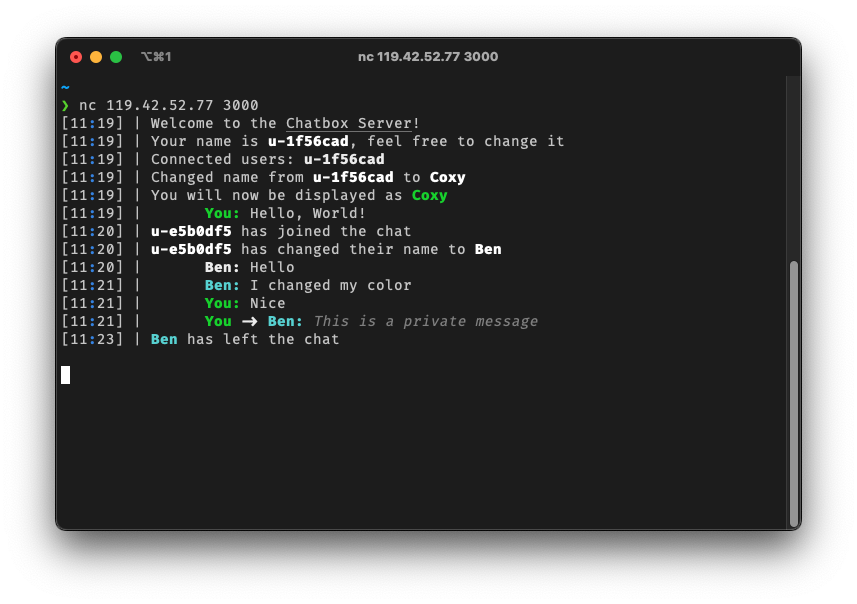

# Chatbox
> 9th March 2023

In response to numerous suggestions, I have decided to explore the use of Rust
programming language. The goal of this project is to create a chat application
that deviates from the traditional approach by not having a dedicated client.
Instead, the plan is to enable communication through a tool like netcat.

The project initially offers a single channel, namely #general, although
additional channels may be added in the future if deemed necessary. The
application will support several user commands which will be documented below.

## Commands

- `/nick <user_nickname>`: This command allows the user to set their desired nickname.

- `/privmsg <user_nickname> <msg>`: Users can send private messages to each other using this command.

- `/color <color_id>`: This command enables users to change the color of their display name. The `color_id` parameter should be a number between `0` and `255`.

- `/list`: This command will list all the active users on the chat server.